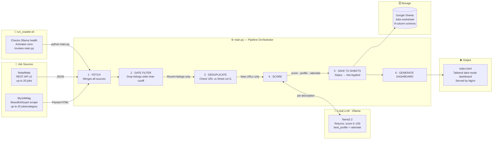

# swe-python-crawler


An autonomous, AI-driven job aggregation pipeline. It scrapes multiple job sources, filters and deduplicates listings, scores each one against a structured candidate profile using a **local** Llama 3.2 model, writes high-value targets to Google Sheets, and publishes a live HTML health dashboard — all at zero LLM cost.

---

## Overview

Most job boards are noise. This pipeline cuts through it automatically:

- **Fetches** jobs from MyJobMag (web scraping) and ReliefWeb (REST API)
- **Filters** by posting date — only recent listings pass
- **Deduplicates** using the job URL as a unique key against the existing Sheet
- **Scores** each job 0–100 against four candidate profiles via local Llama 3.2
- **Appends** results with match scores, profile labels, and rationale to Google Sheets
- **Publishes** a static HTML dashboard showing run stats and all scored jobs

---

## System Architecture



---

## Project Structure

```
swe-python-crawler/
├── extractors/
│   ├── base.py              # JobPost dataclass + JobExtractor ABC
│   ├── myjobmag.py          # HTML scraper (requests + BeautifulSoup4)
│   └── reliefweb.py         # ReliefWeb v2 REST API client
├── matching/
│   └── local_matcher.py     # Ollama/llama3.2 scoring engine (Pydantic output)
├── storage/
│   └── google_sheets.py     # gspread client — schema init, dedup, append
├── reporting/
│   └── dashboard.py         # Static HTML dashboard generator (Tailwind CSS)
├── .github/
│   └── workflows/
│       └── deploy.yml       # GitHub Actions CI/CD → VPS deploy
├── main.py                  # Pipeline orchestrator
├── utils.py                 # Multi-format date parser
├── run_crawler.sh           # Production launcher script
├── requirements.txt
└── .env.example
```

---

## Prerequisites

| Requirement | Notes |
|-------------|-------|
| Python 3.9+ | Tested on 3.9 and 3.12 |
| [Ollama](https://ollama.com/download) | Local LLM runtime |
| `llama3.2` model | ~2 GB, pulled via Ollama |
| Google Cloud Service Account | Needs Sheets API enabled |
| Google Sheet | Share it with the service account as **Editor** |
| ReliefWeb appname | Free registration at [apidoc.reliefweb.int](https://apidoc.reliefweb.int/parameters#appname) |

---

## Environment Variables

Copy `.env.example` to `.env` and fill in all values:

```bash
cp .env.example .env
```

```env
# ── ReliefWeb API ─────────────────────────────────────────────
# Register free at: https://apidoc.reliefweb.int/parameters#appname
RELIEFWEB_APPNAME=your-approved-appname

# ── Google Sheets ─────────────────────────────────────────────
# Absolute path to your downloaded service account JSON key file
GOOGLE_SERVICE_ACCOUNT_JSON=/absolute/path/to/gcp-credentials.json

# The ID from the Sheets URL: /spreadsheets/d/<SPREADSHEET_ID>/edit
GOOGLE_SPREADSHEET_ID=your-spreadsheet-id

# Worksheet tab name (auto-created if it does not exist)
GOOGLE_WORKSHEET_NAME=Jobs

# ── Status Dashboard ──────────────────────────────────────────
# Absolute path where the HTML dashboard is written after each run
STATUS_PAGE_PATH=/home/craigouma/status.sowerved.tech/index.html
```

> **Security note:** `.env` and `gcp-credentials.json` are both listed in `.gitignore` and must never be committed.

---

## Google Sheets Schema

The pipeline writes to the following fixed column layout:

| Col | Header | Description |
|-----|--------|-------------|
| A | Job Title | |
| B | Company/Org | |
| C | Source | `MyJobMag` or `ReliefWeb` |
| D | Match Score | 0–100 integer set by Llama 3.2 |
| E | Best Profile Match | `IT_Support` · `Credit_Analyst` · `Data_Analyst` · `Software_Engineer` · `None` |
| F | Match Rationale | 2-sentence LLM explanation |
| G | Link | Unique key used for deduplication |
| H | Date Posted | |
| I | Status | Defaults to `Not Applied` |

---

## Running Locally

This section covers everything you need to run the pipeline on your own machine and adapt it to your CV.

### 1. Clone and install

```bash
git clone https://github.com/<your-username>/swe-python-crawler.git
cd swe-python-crawler
python -m venv venv
source venv/bin/activate        # Windows: venv\Scripts\activate
pip install -r requirements.txt
```

### 2. Install and start Ollama

Download Ollama from [ollama.com/download](https://ollama.com/download) and install it for your OS. Then pull the model:

```bash
ollama pull llama3.2
```

Ollama must be running before you start the pipeline. On macOS/Linux it runs as a background service after install. If it isn't running, start it manually:

```bash
ollama serve
```

### 3. Set up Google Sheets

1. Go to [console.cloud.google.com](https://console.cloud.google.com), create a project, and enable the **Google Sheets API** and **Google Drive API**.
2. Under **IAM & Admin → Service Accounts**, create a service account and download its JSON key file.
3. Create a new Google Sheet, note the spreadsheet ID from the URL (`/spreadsheets/d/<ID>/edit`), and share the sheet with the service account email as **Editor**.

### 4. Register a ReliefWeb appname

Submit the free registration form at [apidoc.reliefweb.int/parameters#appname](https://apidoc.reliefweb.int/parameters#appname). Approval usually takes a few hours. Use any descriptive name (e.g. `yourname-job-crawler`).

### 5. Configure your `.env`

```bash
cp .env.example .env
```

Edit `.env` with your values:

```env
RELIEFWEB_APPNAME=your-approved-appname
GOOGLE_SERVICE_ACCOUNT_JSON=/absolute/path/to/gcp-credentials.json
GOOGLE_SPREADSHEET_ID=your-spreadsheet-id
GOOGLE_WORKSHEET_NAME=Jobs
STATUS_PAGE_PATH=/tmp/crawler_status/index.html
```

For local use, set `STATUS_PAGE_PATH` to any writable directory. The pipeline creates it if it doesn't exist.

### 6. Run

```bash
python main.py
```

Or use the launcher script (checks Ollama, activates venv, then runs):

```bash
bash run_crawler.sh
```

### Sample output

```
00:37:28  INFO  pipeline  Fetched 36 job(s) total.
00:37:28  INFO  pipeline  SKIP (too old: 2026-04-08)  [MyJobMag]  DevOps Engineer
00:39:47  INFO  matching.local_matcher  Local [llama3.2] scored 'Financial & Data Analyst': 92/100 → Data_Analyst
00:39:47  INFO  storage.google_sheets   Appended: [MyJobMag] Financial & Data Analyst — Solar Panda
00:40:03  INFO  pipeline  Summary: 36 fetched | 8 new appended | 2 High Match(es) found (score >= 75).
00:40:03  INFO  reporting.dashboard     Status page written to /tmp/crawler_status/index.html (permissions: 644)
```

---

## Adapting to Your CV

The pipeline is built around a single candidate profile defined in `matching/local_matcher.py`. Swap in your own details and the scoring engine recalibrates automatically — no other files need changing.

### Changing candidate name and profiles

Open `matching/local_matcher.py` and edit the `_SYSTEM_PROMPT` string. The relevant block starts around line 46:

```python
_SYSTEM_PROMPT = """
...
CANDIDATE: Your Name Here

Profile 1 — IT_Support:
  Describe your IT support skills and years of experience here.

Profile 2 — Credit_Analyst:
  Describe your finance/credit skills here.

Profile 3 — Data_Analyst:
  Describe your data skills, tools, and years of experience here.

Profile 4 — Software_Engineer:
  Describe your engineering stack and experience here.
...
"""
```

**Rules:**
- Keep the four profile labels exactly as-is (`IT_Support`, `Credit_Analyst`, `Data_Analyst`, `Software_Engineer`) — they are validated by Pydantic and referenced in the dashboard colour map.
- Be specific about tools and years. The more precise your profile description, the more accurate the scoring.
- If a profile type doesn't apply to you (e.g. you have no finance background), replace its description with a clearly irrelevant skill set so the model won't mis-assign jobs to it, or remove it by also updating the `Literal[...]` type in `MatchResult` and the `_PROFILE_COLOURS` dict in `reporting/dashboard.py`.

### Renaming profiles

If you want different profile names (e.g. `DevOps_Engineer` instead of `IT_Support`):

1. **`matching/local_matcher.py`** — update the label in `_SYSTEM_PROMPT` and the `Literal[...]` type in `MatchResult`:

```python
best_profile: Literal[
    "DevOps_Engineer",   # renamed from IT_Support
    "Credit_Analyst",
    "Data_Analyst",
    "Software_Engineer",
    "None",
]
```

2. **`reporting/dashboard.py`** — add the new name to `_PROFILE_COLOURS` with your chosen Tailwind colour classes:

```python
_PROFILE_COLOURS = {
    "DevOps_Engineer":   "bg-amber-500/20 text-amber-300 ring-amber-500/40",
    ...
}
```

3. **`storage/google_sheets.py`** — no changes needed; the profile label is written as a plain string to column E.

### Adjusting the date cutoff

The pipeline skips jobs older than `DATE_CUTOFF` in `main.py`:

```python
DATE_CUTOFF = date(2026, 4, 20)
```

Update this to today's date (or earlier) before each use so recent listings aren't filtered out.

### Targeting different job categories

**MyJobMag** — the scraper fetches from hard-coded category URLs in `extractors/myjobmag.py`. Add or replace URLs in the `_CATEGORY_URLS` list to target different fields:

```python
_CATEGORY_URLS = [
    "https://www.myjobmag.co.ke/jobs-by-field/information-technology",
    "https://www.myjobmag.co.ke/jobs-by-field/research-data-analysis",
    "https://www.myjobmag.co.ke/jobs-by-field/engineering",
    # add more category URLs here
]
```

Browse [myjobmag.co.ke/jobs-by-field](https://www.myjobmag.co.ke/jobs-by-field) to find the right paths.

**ReliefWeb** — keyword and theme filters live in `extractors/reliefweb.py`. Edit `_TITLE_KEYWORDS` to add terms relevant to your field:

```python
_TITLE_KEYWORDS = [
    "data engineer",
    "software engineer",
    "devops",
    # add your terms here
]
```

---

## VPS Deployment & Security

### Isolated service user

The pipeline runs under a dedicated, least-privilege Linux user `crawler_svc` with no login shell and no sudo rights. This contains the blast radius if the process is ever compromised.

```bash
# On the VPS — create the service user (run once as root)
useradd --system --no-create-home --shell /usr/sbin/nologin crawler_svc
```

Sensitive files on the VPS are owned by `crawler_svc` and set to `600`:

```bash
chmod 600 /home/crawler_svc/swe-python-crawler/.env
chmod 600 /home/crawler_svc/swe-python-crawler/gcp-credentials.json
```

### CI/CD via GitHub Actions

Every push to `main` triggers `.github/workflows/deploy.yml`, which:

1. Checks out the repository
2. Uses `appleboy/scp-action` to copy all files to the VPS (excludes `.git` and `.github`)
3. Uses `appleboy/ssh-action` to create/update the virtual environment and install dependencies

Configure the following **GitHub Secrets** in your repository settings:

| Secret | Value |
|--------|-------|
| `SERVER_HOST` | VPS IP or hostname |
| `SERVER_USER` | `crawler_svc` |
| `SSH_PRIVATE_KEY` | Private key for `crawler_svc` |

### Cron schedule

After deployment, schedule the crawler to run every 6 hours under the `crawler_svc` user:

```bash
crontab -e -u crawler_svc
```

```cron
0 */6 * * * /home/crawler_svc/swe-python-crawler/run_crawler.sh >> /home/crawler_svc/crawler.log 2>&1
```

---

## The Dashboard

After every run the pipeline writes three files to the `STATUS_PAGE_PATH` directory:

| File | Purpose |
|------|---------|
| `index.html` | Static JS shell — fetches the JSON files at load time and every 5 minutes |
| `jobs_history.json` | Persistent list of every job ever scored, newest first. New jobs are prepended; nothing is ever cleared |
| `stats_latest.json` | Stats from the most recent run (fetched, skipped, scored, high matches) |

The page displays:

- **System status badges** — Ollama and Scrapers online indicators
- **Latest run statistics** — updates automatically when a new crawl completes
- **All Scored Jobs table** — full cross-run history, newest at the top, with a "Crawled At" timestamp per row and 10-row pagination

The browser auto-polls the JSON files every 5 minutes, so the page stays live without a manual refresh. If a crawl finds zero new jobs, the table is untouched.

Serve the output directory from Apache or Nginx as a standard static site. No backend required.

```nginx
server {
    listen 80;
    server_name status.sowerved.tech;
    root /home/craigouma/status.sowerved.tech;
    index index.html;
}
```

---

## Extending the Pipeline

To add a new job source:

1. Create `extractors/your_source.py` — subclass `JobExtractor`, implement `fetch(limit) -> list[JobPost]`
2. Export it from `extractors/__init__.py`
3. Add it to `fetch_all()` in `main.py`

The date filter, deduplication, scoring, and storage steps apply automatically — no other changes needed.

---

## License

MIT
